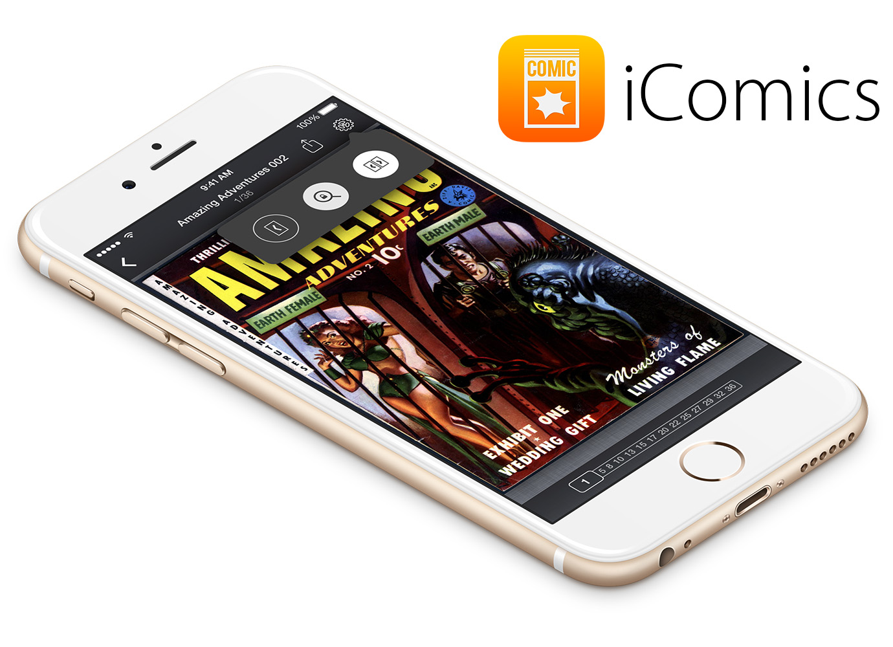

This is the official repo for tracking bugs and managing new features for [iComics](http://icomics.co), the comic reader for iOS. 

## When reporting a bug

Please try to add as much detail about the bug as possible, including your device model, iOS version, and if possible, a list of steps in order to produce the error. Additionally, if it is permissiable, providing a screenshot of the bug, or even the comic file that triggered the bug would be GREATLY appreciated.

## When making a feature request

Please explain what you are envisioning with as much detail as possible, including how you think the feature would work, and what its UI would potentially look like. Feature requests that are just a couple of words aren't the easiest to follow, and sometimes look like they haven't been properly considered beforehand. ;)

If you've got a bug/feature you'd like to submit, but don't want to register for a GitHub account, feel free to send me an email at ***feedback AT icomics DOT co***.

---

iComics is developed by [Tim Oliver](http://github.com/TimOliver). Copyright 2012-2015. iComics is a trademark of Timothy Oliver.